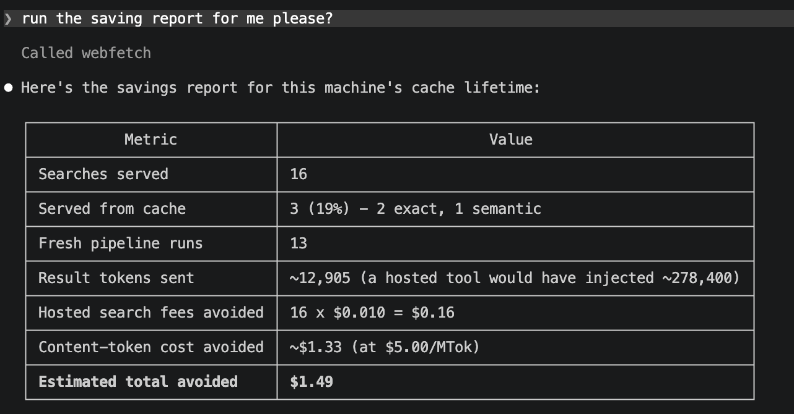
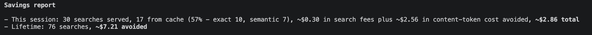

# webfetch

<!-- mcp-name: io.github.firish/webfetch -->

Web search for LLM agents that you run yourself - up to 8x fewer input
tokens and 3x lower cost than hosted web_search, at the same accuracy.

Hosted web-search tools charge $10 per thousand searches and then bill you
again for every token of retrieved content they push into your context
window. webfetch replaces them with a local pipeline - multi-engine
search, page fetching and extraction, semantic reranking, sentence-level
compression - exposed as a `web_search` tool your model calls like any
other. And unlike every hosted tool and search API we surveyed, repeated
and paraphrased queries are served from a semantic cache for free.

(Install with `pip install webfetch-llm`; the import name is `webfetch`.)

**Jump to:**
[The headline](#same-accuracy-a-third-of-the-cost-an-eighth-of-the-tokens) ·
[What you get](#what-you-get) ·
[Getting started](#getting-started) ·
[Check your setup](#check-your-setup) ·
[Full benchmark results](#full-benchmark-results) ·
[Claude Code](#using-it-in-claude-code--claude-desktop) ·
[Agent loop](#use-it-in-your-own-agent-loop) ·
[Savings report](#the-savings-report) ·
[How it works](#how-it-works) ·
[Caveats](#caveats-honestly)

## Same accuracy. A third of the cost. An eighth of the tokens.

One agent loop, one model, one judge, 50 SimpleQA questions. The only
thing that changes between rows is the search tool:

| search tool | accuracy | input tok/query | cost/query |
|---|---|---|---|
| Anthropic hosted web_search | 96% | 17,408 | $0.108 |
| **webfetch** (4-engine fusion) | 92% | **3,467** | **$0.035** |
| **webfetch** (DDG only, $0 in fees) | 84% | 3,623 | $0.026 |

Swap Opus for gpt-5.6-sol and the same webfetch tool hits **96% - hosted
parity - at $0.040/query and 2,156 tokens**: an eighth of what the hosted
tool pushes into your context. [Full results](#full-benchmark-results)
cover every arm we ran.

These numbers are the WORST case for webfetch - measured on an empty
cache. In real use the gap widens on its own: repeats and rewords serve
from cache for free, and the token advantage is paid again on every
later turn that keeps search results in context. It adds up to receipts
like this one, from an ordinary Claude Code session:



Every claim in this README is generated by an eval harness that ships in
this repo - the question sets, per-question records, judging protocol,
and the negative results are all in [evals/](evals/), and every table can
be regenerated with one command.

## What you get

**A search pipeline you own (4-engine RRF fusion, local extraction,
sentence-level compression).** Results come from reciprocal-rank fusion
across DuckDuckGo, Brave, Serper, and Tavily - whichever of them you have
keys for. DDG needs no key, so the tool works at literally zero cost out
of the box; every key you add joins the fusion automatically. Pages are
fetched and extracted locally (trafilatura, readability, newspaper4k,
Playwright rendering for JS pages and 403 walls), chunked, ranked by a
hybrid BM25 + bi-encoder cascade with a cross-encoder on top, then
compressed to the sentences that answer the query - measured 50% fewer
tokens at zero recall loss.

**Caching nobody else has (exact + semantic matching, volatility-aware
TTLs).** Two layers in one sqlite file: page text by
URL, ranked results by query. Identical queries hit an exact cache.
Paraphrased queries hit a semantic cache - an embedding shortlist
verified by an NLI cross-encoder, tuned eval-first for precision (zero
wrong-target matches across every live run we have done). Cache lifetimes
adapt to the query: prices and scores expire in 15 minutes, current-ish
topics in 7 days, release notes and specs in 90 - classified by the
calling model's hint or a local classifier. The model sees provenance on
every cached result (`[cache: semantic match to "...", 2h old, recent]`)
and can send `force_fresh` when it disagrees. No hosted tool or search
API we surveyed offers any client-visible caching at all.

**The model can maintain its own cache (save_finding, labeled
UNVERIFIED, kill switch included).** If a search comes up empty and
the model answers from some other source (a hosted search fallback, say),
it can call `save_finding` to store what it learned - marked
model-contributed, served with an explicit UNVERIFIED warning and a
force_fresh escape hatch, and aged out on the normal TTL rules. A kill
switch (`SAVE_FINDING_ENABLED = False`) exists for deployments that never
want unverified content cached.

**Levers where models actually need them (full_results, fetch_url,
freshness, force_fresh).** `full_results` returns
uncompressed excerpts for list and ranking queries (compression trims
parallel list items - we measured it). `fetch_url` pulls one cited page
in full, instantly if the pipeline has ever fetched it. `freshness` hints
control cache lifetime; `force_fresh` bypasses it.

**Receipts (session and lifetime, exact counters).** Usage counters
persist in the cache file;
`webfetch-savings` (or the `savings_report` tool) shows what you did not
pay hosted-search pricing for, split by this session and lifetime.
[Sample below.](#the-savings-report)

## Getting started

The one-liner (uv installs the package on first launch, `@latest` picks
up new releases automatically):

```
claude mcp add webfetch -- uvx --from webfetch-llm@latest webfetch-mcp
```

Or manage the install yourself, two commands:

```
pip install "webfetch-llm[all]"
claude mcp add webfetch -- webfetch-mcp
```

The slim install (`webfetch-llm` without extras) starts in seconds and
runs degraded: BM25 ranking, exact-only cache, lexical compression.
`[all]` pulls the semantic stack (torch - a few minutes once) plus
Playwright, PDF, and table extraction; it is the configuration every
benchmark number in this README was measured on. Needs pip >= 24 in fresh
venvs (`python -m pip install -U pip` - older pips crash on a duplicated
extra in our dependency tree). If you install into a venv, register the
absolute path to `webfetch-mcp` or keep the venv active.

Keys are optional (DDG works with none) but improve recall - all the
engines have free tiers:

```
cp .env.example .env    # fill in what you have
```

The console scripts and the MCP server pick up a `.env` from the
directory they run in; exported env vars and `--env` flags on
`claude mcp add` always take precedence. `import webfetch` as a library
never reads `.env` - your process env is yours.

## Check your setup

`webfetch-status` (or asking the model to call the `status` tool) answers
"is my key being picked up, and what am I actually running?":

```
webfetch 0.1.3

search engines:
  ddg      ready (no key needed)
  brave    ready (BRAVE_API_KEY is set)
  serper   off   (SERPER_API_KEY not set)
  tavily   ready (TAVILY_API_KEY is set)

active provider: multi(ddg+brave+tavily) (RRF fusion)

optional features:
  semantic ranking/cache/compression: on
  JS-page rendering (playwright):     on
  PDF extraction (pdfplumber):        OFF (pip install 'webfetch-llm[pdf]')
  HTML tables (pandas+tabulate):      on
  result compression:                 on (crossencoder)

cache: /Users/you/.webfetch/cache.db
  5.4 MB, 70 lifetime searches (webfetch-savings for the receipt)
```

Key names only - values are never printed. Configuration is environment
variables, read at server start:

| variable | effect |
|---|---|
| `BRAVE_API_KEY`, `SERPER_API_KEY`, `TAVILY_API_KEY` | each key adds an engine to the fusion |
| `WEBFETCH_PROVIDER` | `multi` (default: fuse everything keyed), `fallback` (DDG serves, keyed engines catch its blocks), or a single engine name |
| `WEBFETCH_CACHE_DB` | relocate the cache file (default `~/.webfetch/cache.db`) |

With zero keys the default resolves to plain DDG; the status output says
so honestly rather than calling it fusion. Library users can skip env
entirely: `Pipeline(search=get_search_adapter("fallback"), cache=...)`.

## Full benchmark results

Every arm, same 50 SimpleQA questions, same judge, one same-day run
(2026-07-14). Agent-loop arms share an identical loop; only the search
tool differs. Costs include model tokens plus each provider's published
per-search fees; ours include estimated engine fees.

| search tool | model | accuracy | input tok/q | cost/q |
|---|---|---|---|---|
| OpenAI hosted web_search | gpt-5.6-sol | 100% | 10,027 | $0.066 |
| webfetch (4-engine fusion) | gpt-5.6-sol | 96% | 2,156 | $0.040 |
| Anthropic hosted web_search | Opus 4.7 | 96% | 17,408 | $0.108 |
| webfetch (4-engine fusion) | Opus 4.7 | 92% | 3,467 | $0.035 |
| Exa (search + contents) | Opus 4.7 | 90% | 5,496 | $0.053 |
| Tavily | Opus 4.7 | 88% | 6,387 | $0.047 |
| webfetch (DDG only) | Opus 4.7 | 84% | 3,623 | $0.026 |
| webfetch (4-engine fusion) | Haiku 4.5 | 76%* | 3,021 | $0.031 |

\* Haiku's failures were mostly re-searching past the turn cap, and its
last few questions ran on a degraded engine set after we exhausted a free
tier mid-benchmark. Treat it as a floor.

Notice the token column: webfetch results cost half the input tokens of
the snippet APIs and a fifth to an eighth of the hosted tools - which is
why our cost stays lowest even where per-search fees are similar.

On a second dataset of 27 questions about events from the two weeks
before the run (hand-written, never published, so no vendor could have
tuned on them), webfetch scored 100% with fusion and 100% with DDG alone;
the hosted tools also scored 100%. Fresh events are not the hard part -
the [date-injection trap](#use-it-in-your-own-agent-loop) is.

Reproduce: `python evals/run_e2e_eval.py --arms ours-multi,hosted` - the
harness, datasets, and per-question records are in [evals/](evals/).

## Using it in Claude Code / Claude Desktop

Fastest route in Claude Code - install it as a plugin, two slash
commands (runs the same uv one-liner under the hood):

```
/plugin marketplace add firish/webfetch
/plugin install webfetch@webfetch
```

Or [register the MCP server yourself](#getting-started). Either way, a
new session shows `webfetch` under `/mcp` with five tools: `web_search`, `fetch_url`,
`save_finding`, `status`, and `savings_report`. Ask anything recent and
watch the tool calls; ask the same thing reworded and the result comes
back with a `[cache: semantic match ...]` header instead of a fresh
search. First call in a session is slow (encoder warm-up plus real page
fetches, 10-40s); cached calls are instant.

Toggle the server off per-session in `/mcp`; remove it with
`/plugin uninstall webfetch` or `claude mcp remove webfetch`, matching
how you installed it. Your cache and its receipt history live in
`~/.webfetch/` and survive reinstalls. Run one server per machine - the
semantic cache assumes a single process owns its file.

Update notice: the server makes one request to pypi.org per process to
check for a newer release, surfaced as one line in `savings_report`
output. `UPDATE_CHECK_ENABLED = False` in `webfetch/config.py` disables
it; nothing else is ever sent anywhere.

## Use it in your own agent loop

```python
import time
import anthropic
from webfetch import WEB_SEARCH_TOOL, handle_web_search

client = anthropic.Anthropic()
messages = [{"role": "user", "content": "What did the FOMC decide this week?"}]
system = (f"Today's date is {time.strftime('%Y-%m-%d')}. "
          "Use web_search for recent facts.")

while True:
    response = client.messages.create(
        model="claude-opus-4-7", max_tokens=2000, system=system,
        tools=[WEB_SEARCH_TOOL], messages=messages,
    )
    if response.stop_reason != "tool_use":
        break
    messages.append({"role": "assistant", "content": response.content})
    results = [{"type": "tool_result", "tool_use_id": b.id,
                "content": handle_web_search(b.input)}
               for b in response.content if b.type == "tool_use"]
    messages.append({"role": "user", "content": results})
```

A complete version with prompt caching and adaptive thinking is in
[examples/agent_loop.py](examples/agent_loop.py). The tool schema is
provider-agnostic in spirit - OpenAI function calling needs only a
mechanical reshape of the dict.

**Put today's date in your system prompt.** This is not optional. Models
refuse to search for events they believe have not happened yet: on our
fresh-events dataset, loops without the date declined to even call the
tool on up to 10 of 27 questions ("Wimbledon 2026 hasn't taken place
yet"). One line fixes it. Hosted search tools do this server-side, which
is part of why nobody notices until they run their own tool.

`handle_web_search` never raises. Engine failures, empty results, and
malformed input come back as readable strings the model can react to,
because an exception mid-conversation kills the whole agent loop.

## The savings report

Counters accumulate in the cache file as you search. Ask the model to run
the report, or run `webfetch-savings` yourself. The MCP tool splits this
session from lifetime, so you can see what one conversation saved:



That one-liner unpacked - a 30-search session on this machine:

| | this session | lifetime |
|---|---|---|
| searches served | 30 | 76 |
| served from cache | 17 (57%) - 10 exact, 7 semantic | - |
| search fees avoided | ~$0.30 | |
| content-token cost avoided | ~$2.56 | |
| **estimated total avoided** | **~$2.86** | **~$7.21** |

Counters are exact; the dollar lines are estimates with the assumptions
(hosted per-search fee, hosted tokens per call - both measured - and your
model's token price) exposed as arguments to `webfetch.savings_report()`.

## How it works

```
query -> multi-engine search (RRF fusion, circuit breakers)
      -> semantic query cache? serve with provenance header
      -> fetch pages concurrently (page cache by URL)
      -> extract (trafilatura -> readability -> newspaper4k -> playwright)
      -> chunk (400 chars) -> BM25 + bi-encoder fusion -> cross-encoder top 5
      -> compress to query-relevant sentences -> source-labeled result
```

Everything heavy is optional: without `[rerank]` you get BM25 ranking,
exact-match caching, and lexical compression, with a logged warning
instead of an ImportError. DDG deserves a special note: it
fingerprint-blocks automated clients with silent empty responses.
webfetch detects that (empty-with-peers in fusion, any empty in the
fallback chain), benches the engine on a circuit breaker, and routes
around it; the TLS side is handled by the `ddgs` dependency.

Design decisions and their measurements are documented as they happened
in [docs/architecture.md](docs/architecture.md) and
[docs/ROADMAP.md](docs/ROADMAP.md) - including the negative results.

## Caveats, honestly

- Latency. A fresh search takes 10-40 seconds - real pages get fetched
  and ranked locally. Hosted search returns in ~10s, snippet APIs in ~6s.
  Cache hits are instant. If you need sub-second search and do not care
  about cost, this is not your tool.
- The cache is single-process. One agent loop, one MCP server, or one
  notebook at a time; a shared team cache backend is on the roadmap.
- Engine free tiers are real quotas. We exhausted Brave's monthly tier
  during benchmarking. The resilience layer degrades gracefully, but your
  recall degrades with it. Engine fees in the tables are estimates from
  published prices.
- Answer quality depends on the model driving the tool - weak models
  formulate worse queries and re-search instead of reading (see the Haiku
  row).
- Semantic-cache recall on cross-form rewords ("what did X add" vs
  "X new features") is partial: measured 6/10 on real pairs after tuning,
  because some paraphrase forms defeat every available verifier. Misses
  cost a re-search, never a wrong answer.

## Benchmarks and data

Three eval layers, all in [evals/](evals/): an offline matcher eval that
picks the semantic-cache thresholds, a live retrieval eval (recall,
tokens, cache diagnostics), and the end-to-end answer eval quoted above
(SimpleQA protocol: normalized exact match, then an LLM judge). Datasets
are built deterministically from SimpleQA (MIT), QQP/GLUE, and FreshQA
(CC-BY-SA), with provenance sidecars next to each file. The fresh-events
set was hand-written against verified news sources days before the
benchmark ran, specifically so no model or vendor pipeline could have
seen it.

## License

MIT.
